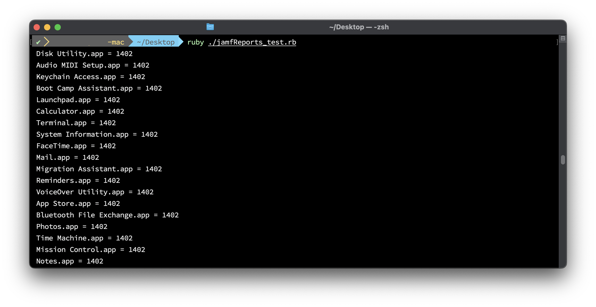
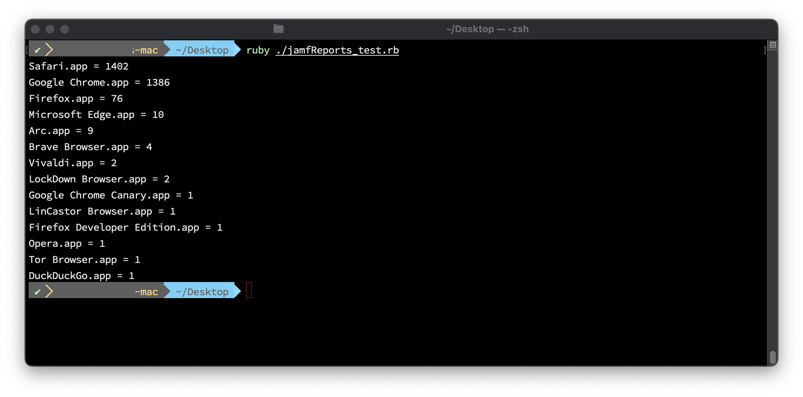
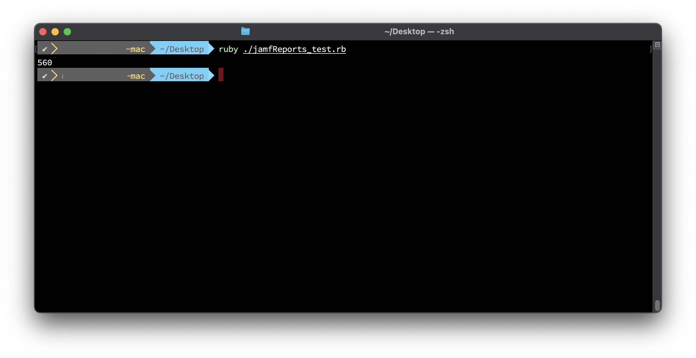
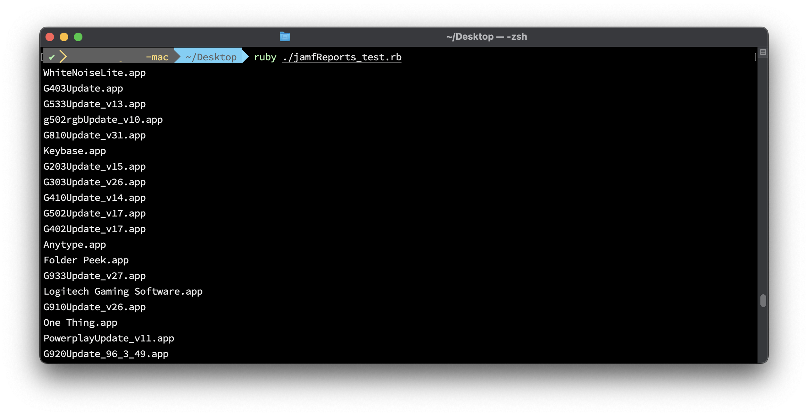

# JamfReports

## Summary

JamfReports is a ruby gem that uses the Jamf Pro API for hosted instances. Currently, it only reports on Applications. Pulling from the `/api/v1/computers-inventory?section=APPLICATIONS` endpoint.

Future reports may be added.


## Installation

Add this line to your application's Gemfile:

```ruby
gem 'JamfReports'
```

And then execute:

    $ bundle

Or install it yourself as:

    $ gem install JamfReports

## Usage

In order to run JamfReports, you are required to add these two lines to the top of your file, under the require `JamfReports` line

```ruby
#!/usr/bin/ruby
require "JamfReports"

## UPDATE THESE VARIABLES ------------------------------------------------------
$jamfpro_url = "https://company.jamfcloud.com" 
$api_pw = "Your API KEY HERE"
```

 If you don't have your api key for the `$api_pw` variable, run this command to create it and paste it into the variable.

```bash
printf "jamfUserName:JamfPassword" | iconv -t ISO-8859-1 | base64 -i -
```


And these 3 lines to generate the api token and pull the data from Jamf so you can run the report commands.

```ruby
JamfReports.getToken
JamfReports.checkTokenExpiration
JamfReports.getAllApplicationInventory
```

A full working file might look like this.

```ruby
#!/usr/bin/ruby
require "JamfReports"

## UPDATE THESE VARIABLES ------------------------------------------------------
$jamfpro_url = "https://company.jamfcloud.com" 
$api_pw = "Your API KEY HERE"

## COMMANDS --------------------------------------------------------------------
JamfReports.getToken
JamfReports.checkTokenExpiration
JamfReports.getAllApplicationInventory

## REPORTS --------------------------------------------------------------------
JamfReports.listAllInstalledApps
# JamfReports.webBrowserReport
# JamfReports.totalNumberOfOneInstalledApps
# JamfReports.listofOneInstallApps

## After reporting, revoke current token
JamfReports.invalidateToken
```


For more usage and examples see this blog post

## Examples

#### listAllInstalledApps



Returns a sorted list of all apps installed across your fleet of computers in Jamf. Sorted from most installed app, to least.

#### webBrowserReport

Returns a list of installed web browsers. Current browsers searched are:
- Google Chrome.app
- Google Chrome Canary.app
- Firefox.app
- Firefox Developer Edition.app
- Safari.app
- Safari Technology Preview.app
- Microsoft Edge.app
- Brave Browser.app
- Arc.app
- Opera.app
- LinCastor Browser.app
- LockDown Browser.app
- Tor Browser.app
- Vivaldi.app
- DuckDuckGo.app

#### totalNumberOfOneInstalledApps

Returns a single metric to show the number of "One-off" or single installed apps across your fleet.

#### listofOneInstallApps


Returns a list of all the "One-off" or single installed apps across your fleet. This can be helpful in scoping in Jamf uninstall policies.


## License

The gem is available as open source under the terms of the [MIT License](https://opensource.org/licenses/MIT).
